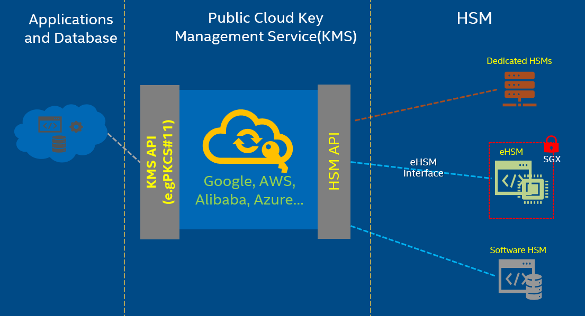
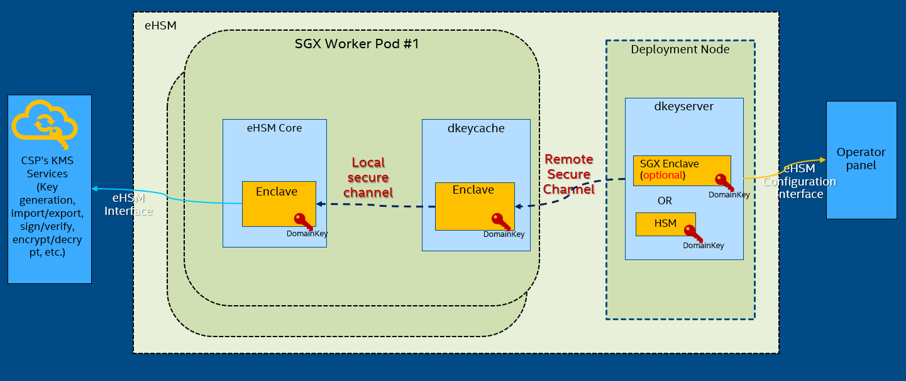

# eHSM (SGX Enclave Based Hardware Security Module)

Cloud KMS (Key Management System) is a hardware-software combined system that provides customers
with capabilities to create and manage cryptographic keys and control their use for cloud services.

Typically, it is backed with HSM (Hardware Security Module). However,the existing hardware HSM solution
is very expensive and complex to manage. So, many CSPs will provide Cloud HSM solutions to alleviate the
problem of the scalability and availability issues, but they are still depend on the dedicated external
hardware devices, and currently there's no opensource with low cost and scalable secure HSM solution for
Cloud KSM scenario.

This project is called eHSM, which is provided as a reference code based on Intel Software Guard Extensions(SGX)
technology. It's designed to be protected from processes running at higher privilege levels, like OS kernel,
hypervisor, BIOS firmware.

And Compared with the traditional solution,eHSM is an open source solution with low cost, high scalability,
and high availability and could provide the equivalent protection level of cryptographic functionalities,
including key generation, management, use etc. in the SGX enclave.

It is intended to be deployed into Cloud Environment as an alternative solution for the Cloud KMS product.

## Overview of the KMS & HSM
the below diagram depicts the high level relationships between KMS and HSM,



## Architecture of eHSM

The below diagram depicts the high level architecture of the eHSM,



## Components and Services

### ehsm-dkeyserver
It will be deployed in an HSM-equipped platform or an SGX-capable platform, and runs as a TCP/IP socket server.

- Responsible for generating DK(domainkey) and protecting it in the HSM or enclave.

- Respond to the connection request from ehsm-dkeycache agent and deploy the DK to it via a remote secure channel
based on the SGX remote attestation.

- It may also provide some eHSM Configuration interfaces to the Customer Operator Panel to manage the domains.
(depending on the requirements, and not implemented yet.)


### ehsm-dkeycache
It will be deployed in the SGX worker node(1:1 map with ehsm-core in a Pod), and runs as a proxy agent service.

- Responsible for retrieving the DK from the ehsm-dkeyserver via remote secure channel and then distributing to
ehsm-core instance via local secure channel.


### ehsm-core
It will be deployed in the SGX worker node(1:1 map with ehsm-dkeycache in a Pod), and runs as a service to provide
main KMS functionality interfaces implementation to the Customer KMS Manager.

Currently, it now support the following cryptographic functionalities:
- CreateKey
    - AES_128 (GCM)
    - RSA_3072
- ImportKey
- Encrypt/ Decrypt
    - AES_GCM128
    - RSA_3072 (Padding: RSAES_OAEP_SHA_256)
- Sign/Verify
    - RSA_3072 (Padding: RSA_PKCS1_SHA_256)
- GenerateDataKey
- GenerateDataKeyWithoutPlaintext
- ExportDataKey


## Build Instructions

```shell
# make

The binary will be generated in the bin folder.
bin/
├── ehsm-core
│   ├── ehsm-core
│   ├── libenclave-ehsm-core.signed.so
│   └── libenclave-ehsm-core.so
├── ehsm-dkeycache
│   ├── ehsm-dkeycache
│   ├── libenclave-ehsm-dkeycache.signed.so
│   └── libenclave-ehsm-dkeycache.so
└── ehsm-dkeyserver
    ├── ehsm-dkeyserver
    ├── libenclave-ehsm-dkeyserver.signed.so
    └── libenclave-ehsm-dkeyserver.so

```

## Deployment
To simply demonstrate the eHSM system, the below steps try to deploy the above three components in a single SGX worker node.
But for the real product, the user need to deploy them into different platform according with the above desciptions.

- Setup the DCAP server
    - following the wiki [intel-software-guard-extensions-data-center-attestation-primitives-quick-install-guide](https://software.intel.com/content/www/us/en/develop/articles/intel-software-guard-extensions-data-center-attestation-primitives-quick-install-guide.html)
- Start the service of ehsm-dkeyserver
    ```shell
    # cd bin/ehsm-dkeyserver
    # sudo ./ehsm-dkeyserver
    it will create a socket server and wait the connection request from ehsm-dkeycache agent and deploy the DK to it via a remote secure channel based
    on the SGX remote attestation. (The PCCS server is  the above step)
    ```
***Note**** It's Recommend that the ehsm-dkeycache and ehsm-core should be deployed into one Pod with 1:1 mapping
- Start the service of ehsm-dkeycache
    ```shell
    # cd bin/ehsm-dkeycache
    # sudo ./ehsm-dkeycache

    It will try connect to the deployserver to retrieve the DK via the secure remote channel estabilished by the remote attestation. Then it will create another new
    socket to wait the connection from ehsm-core service.
    A local secure channel based the local attestation protocol will be setup which used to transfer the DK between dkeycache and ehsm-core.

    ```
- Start the service of ehsm-core
    ```shell
    # cd bin/ehsm-core
    # sudo ./ehsm-core

    It will try connect to the dkeycache to retrieve the DK via the local secure remote channel, then keep it in the SGX enclave.

    When the DK provisioning is done, each key materials generated/imported/exported from the ehsm-core service will be encrypted by the DK, only the cipher text will
    be returned to the caller.
    A local secure channel based the local attestation will be setup which used to transfer the DK between dkeycache and ehsm-core.

    ```
