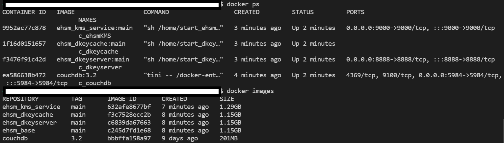
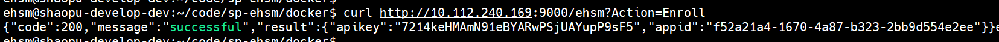
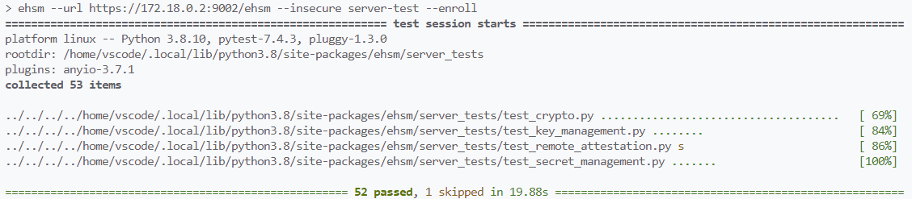

# Build-Instructions

Welcome to see the build instructions for the ehsm-kms project.

## Quick start with Docker Compose

**Notes:** The below steps has been verified on the **Ubuntu-20.04**.

* Install requirement tools

    ``` shell
    sudo apt update

    sudo apt install vim autoconf automake build-essential cmake curl debhelper git libcurl4-openssl-dev libprotobuf-dev libssl-dev libtool lsb-release ocaml ocamlbuild protobuf-compiler wget libcurl4 libssl1.1 make g++ fakeroot libelf-dev libncurses-dev flex bison libfdt-dev libncursesw5-dev pkg-config libgtk-3-dev libspice-server-dev libssh-dev python3 python3-pip  reprepro unzip libjsoncpp-dev uuid-dev liblog4cplus-1.1-9 liblog4cplus-dev dnsutils
    ```

* Install SGX SDK

    ```shell
    wget https://download.01.org/intel-sgx/sgx-linux/2.23/as.ld.objdump.r4.tar.gz
    tar -zxf as.ld.objdump.r4.tar.gz
    sudo cp external/toolset/{current_distr}/* /usr/local/bin

    wget https://download.01.org/intel-sgx/sgx-dcap/1.20/linux/distro/ubuntu20.04-server/sgx_linux_x64_sdk_2.23.100.2.bin

    #choose to install the sdk into the /opt/intel
    chmod a+x ./sgx_linux_x64_sdk_2.23.100.2.bin && sudo ./sgx_linux_x64_sdk_2.23.100.2.bin

    source /opt/intel/sgxsdk/environment
    ```

* Install DCAP required packages

    ```shell
    cd /opt/intel

    wget https://download.01.org/intel-sgx/sgx-dcap/1.20/linux/distro/ubuntu20.04-server/sgx_debian_local_repo.tgz

    tar xzf sgx_debian_local_repo.tgz

    echo 'deb [trusted=yes arch=amd64] file:///opt/intel/sgx_debian_local_repo focal main' | sudo tee /etc/apt/sources.list.d/intel-sgx.list

    wget -qO - https://download.01.org/intel-sgx/sgx_repo/ubuntu/intel-sgx-deb.key | sudo apt-key add -

    sudo apt-get update

    sudo apt-get install -y libsgx-enclave-common-dev  libsgx-ae-qe3 libsgx-ae-qve libsgx-urts libsgx-dcap-ql libsgx-dcap-default-qpl libsgx-dcap-quote-verify-dev libsgx-dcap-ql-dev libsgx-dcap-default-qpl-dev libsgx-quote-ex-dev libsgx-uae-service libsgx-ra-network libsgx-ra-uefi
    ```

* Change PCCS server IP

    ``` shell
    vim /etc/sgx_default_qcnl.conf
    ```

    ``` vi
    # PCCS server address
    PCCS_URL=https://1.2.3.4:8081/sgx/certification/v4/ (your pccs IP)

    # To accept insecure HTTPS certificate, set this option to FALSE
    USE_SECURE_CERT=FALSE
    ```

* Install Docker Compose

    ``` shell
    sudo apt install docker-compose-plugin
    docker compose --version
    # Docker Compose version v2.21.0
    ```

* Build and Run ehsm-kms with Docker Compose

    ```shell
    # Download the ehsm code from github
    git clone --recursive https://github.com/intel/ehsm.git ehsm && cd ehsm

    vim docker/.env
    # Modify the docker/.env configurations
    # ======== docker/.env BEGIN ========
    HOST_IP=1.2.3.4                 # MUST modify it to your host IP.
    PCCS_URL=https://1.2.3.4:8081   # MUST modify it to your pccs server url.
    DOCKER_FILE=Dockerfile.ubuntu20 # MUST modify it to your docker file.
    DKEYSERVER_PORT=8888            # (Optional) the default port of dkeyserver, modify it if you want.
    KMS_PORT=9000                   # (Optional) the default KMS port, modify it if you want.
    TAG_VERSION=main                # (Optional) the default code base is using the main latest branch, modify it to specific tag if you want.
    # ======== docker/.env END ========

    # (Optional) Modify the docker/.env.pccs configurations if PCCS service is needed
    # Subscribe to Intel Provisioning Certificate Service and receive an API key
    # Checkout https://api.portal.trustedservices.intel.com/provisioning-certification for more information
    # ======== docker/.env.pccs BEGIN ========
    API_KEY=                      # MUST modify it to your API key obtained from registry
    # ======== docker/.env.pccs END ========

    # Start to build and run the docker images (couchdb, dkeyserver, dkeycache, ehsm_kms_service)
    cd docker && docker compose up -d
    # (Optional) If you want to start PCCS service as well, use `pccs` profile
    docker compose --profile=pccs up -d
    ```

    You will get below results:

    

* Enrollment of the APPID and APIKey

    ``` shell
    curl [--insecure] https://1.2.3.4:9000/ehsm?Action=Enroll
    ```

    

* Run the unittest cases (you can do it in another remote device)
    * Test with python SDK

    ``` shell
    # (Optional) create a virutal environment first
    python3 -m venv ./ehsm-venv && source ./ehsm-venv/bin/activate
    # Install python SDK
    cd sdk/python && pip install .
    # Run testcases with `ehsm` module
    python3 -m ehsm --url https://127.0.0.1:9002/ehsm --insecure server-test --enroll
    ```

    Then, you will get the below test result:

    

**Notes:**
If you want to deploy the ehsm-kms service into the K8S environment, please refer to the doc [deployment-instructions](deployment-instructions.md).
