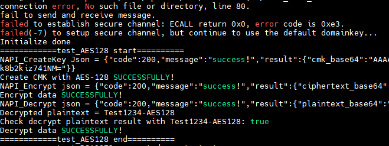
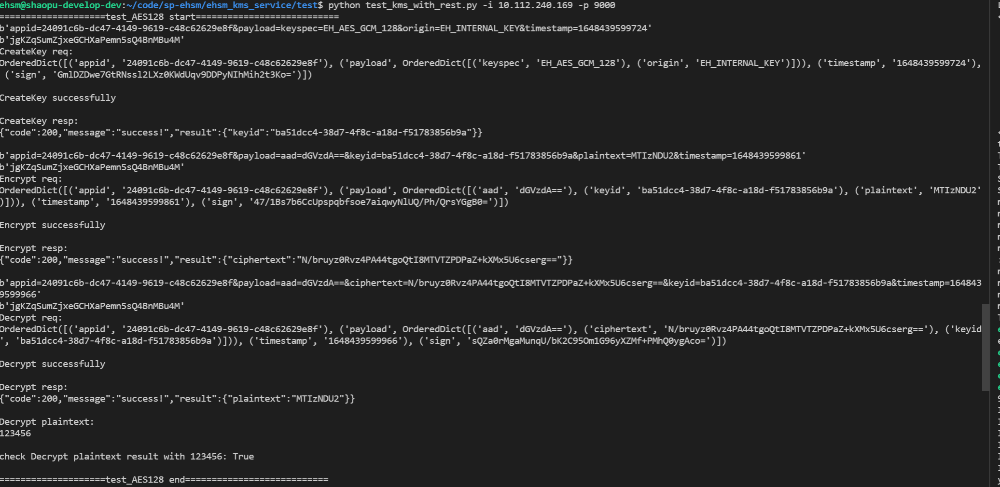

# Build-Instructions

Welcome to see the build instructions for the ehsm-kms project.


## Quick start with Docker

* Install SGX SDK

```shell
wget https://download.01.org/intel-sgx/sgx-dcap/1.12.1/linux/distro/ubuntu20.04-server/sgx_linux_x64_sdk_2.15.101.1.bin

#choose to install the sdk into the /opt/intel
chmod a+x ./sgx_linux_x64_sdk_2.15.101.1.bin && sudo ./sgx_linux_x64_sdk_2.15.101.1.bin

source /opt/intel/sgxsdk/environment
```

* Build the ehsm-kms docker image
```shell
git clone https://github.com/intel/ehsm.git ehsm && cd ehsm

./docker/core/build_and_run.sh -b
#it will generate the docker image <ehsm_kms_service.tar.gz> under ./docker/core
```

* Install CouchDB
```shell
docker pull couchdb

#change the user, password, and port here if needed
docker run --name my-couchdb -e COUCHDB_USER=admin -e COUCHDB_PASSWORD=password -p 5984:5984 -d couchdb
```

* Change corresponding user, passwork, IP, etc. in build_and_run.sh
``` shell
vim docker/core/build_and_run.sh
```
``` vim
EHSM_CONFIG_COUCHDB_USERNAME="admin" (your username)
EHSM_CONFIG_COUCHDB_PASSWORD="password" (your password)
EHSM_CONFIG_COUCHDB_SERVER="1.2.3.4" (your IP)
EHSM_CONFIG_COUCHDB_PORT="5984" (your port)
```

* Run the ehsm-kms service with docker
```shell
cd ./docker/core
./build_and_run.sh -r 
or
./build_and_run.sh -r ehsm_kms_service.tar.gz

docker ps
CONTAINER ID   IMAGE                     COMMAND                  CREATED         STATUS         PORTS                                                               NAMES
035bd3b208bb   ehsm_kms_service:latest   "sh /home/start_ehsm…"   1 minutes ago    Up 1 minutes    0.0.0.0:9000->9000/tcp, :::9000->9000/tcp                             heuristic_germain
72b9f592eff7   couchdb                   "tini -- /docker-ent…"   10 minutes ago   Up 10 minutes   4369/tcp, 9100/tcp, 0.0.0.0:5984->5984/tcp, :::5984->5984/tcp   my-couchdb
```

* Wait about 1 min and check whether the eHSM is listening
``` shell
docker logs 035bd3b208bb (your ehsm_kms_service ID)

#it should be like this
...
failed to connect, sleep 0.5s and try again...
failed to connect, sleep 0.5s and try again...
ehsm_ksm_service application listening at 10.112.240.188:9000
```


## Build and Run without Docker

The following steps have been verified on ubuntu-20.04.

### Install requirement tools

``` shell
sudo apt update

sudo apt install vim autoconf automake build-essential cmake curl debhelper git libcurl4-openssl-dev libprotobuf-dev libssl-dev libtool lsb-release ocaml ocamlbuild protobuf-compiler wget libcurl4 libssl1.1 make g++ fakeroot libelf-dev libncurses-dev flex bison libfdt-dev libncursesw5-dev pkg-config libgtk-3-dev libspice-server-dev libssh-dev python3 python3-pip  reprepro unzip libjsoncpp-dev
```

*  Install SGX DCAP Driver (**optional**)
    * The DCAP Driver is the recommended driver to use on the Linux kernel version between 4.15 and 5.6 inclusive and on platforms that support and are configured for Flexible Launch Control.
    * **kernel 5.11 or higher** do not need this optinonal driver. Installing DCAP driver on **kernel 5.11 or higher** with SGX In-Kernel driver will give the build error message, "Can't install DCAP SGX driver with inkernel SGX support".

``` shell
wget https://download.01.org/intel-sgx/sgx-dcap/1.12.1/linux/distro/ubuntu20.04-server/sgx_linux_x64_driver_1.41.bin

chmod a+x sgx_linux_x64_driver_1.41.bin

sudo apt install dkms

sudo ./sgx_linux_x64_driver_1.41.bin

```

* Install DCAP required packages
```shell
echo 'deb [arch=amd64] https://download.01.org/intel-sgx/sgx_repo/ubuntu focal main' | sudo tee /etc/apt/sources.list.d/intel-sgx.list

wget -qO - https://download.01.org/intel-sgx/sgx_repo/ubuntu/intel-sgx-deb.key | sudo apt-key add -

sudo apt-get update

sudo apt-get install -y libsgx-enclave-common-dev  libsgx-ae-qe3 libsgx-ae-qve libsgx-urts libsgx-dcap-ql libsgx-dcap-default-qpl libsgx-dcap-quote-verify-dev libsgx-dcap-ql-dev libsgx-dcap-default-qpl-dev libsgx-quote-ex-dev libsgx-uae-service libsgx-ra-network libsgx-ra-uefi
```

* Change PCCS server IP
``` shell
vim /etc/sgx_default_qcnl.conf
```
``` vi
# PCCS server address
PCCS_URL=https://1.2.3.4:8081/sgx/certification/v3/ (your pccs IP)

# To accept insecure HTTPS certificate, set this option to FALSE
USE_SECURE_CERT=FALSE
```

### Build eHSM

* Build the eHSM-KMS
```shell
git clone https://github.com/intel/ehsm.git ehsm && cd ehsm

make

Notes: you can find the services binaries under the out/ehsm-core folder 
```
* Unittest w/o REST Call
```shell
cd out/ehsm-core
sudo ./ehsm_core_test
```
Then, you will get the below test result:<br>



* Enable REST APIs
```shell
#install nodejs-16
sudo apt install -y curl
curl -fsSL https://deb.nodesource.com/setup_16.x | sudo -E bash -
sudo apt update
sudo apt install -y nodejs

node --version
v16.1.0

#copy the required *.so to the ehsm_kms_service
cd ehsm_kms_service
cp ../out/ehsm-core/libehsmnapi.so .
cp ../out/ehsm-core/libenclave-ehsm-core.signed.so .

#install the required npm js libs for the kms service
npm install
```

* Install CouchDB
```shell
docker pull couchdb

#change the user, password, and port here if needed
docker run --name my-couchdb -e COUCHDB_USER=admin -e COUCHDB_PASSWORD=password -p 5984:5984 -d couchdb
```

* Export your user, passwork, IP, and port to root environment (these params need change)
``` shell
sudo su (if not root now)
export EHSM_CONFIG_COUCHDB_USERNAME="admin"
export EHSM_CONFIG_COUCHDB_PASSWORD="password"
export EHSM_CONFIG_COUCHDB_SERVER="1.2.3.4"
export EHSM_CONFIG_COUCHDB_PORT="5984"
```
``` shell
#start the kms service (if you got "Error: listen EADDRINUSE: address already in use :::9000", please close the previous service or containers)
sudo node ehsm_kms_server.js &
```

## Run the unittest cases (you can do it in another remote device)
* Need [Install requirement tools](#install-requirement-tools)
* Enroll your appid and apikey
``` shell
cd ehsm_kms_service/enroll_app
make

cd ../../out/ehsm-kms_enroll_app
./ehsm-kms_enroll_app http://1.2.3.4:9000/ehsm/ (change to your ip and port)
```
You will get below results:<br>


* Test with python script
``` shell
cd ehsm_kms_service/test
vim test_kms_with_rest.py (change appid and apikey to your enroll result)
python3 test_kms_with_rest.py -i <your-kms-ip> -p <your-kms-port>
```

Then, you will get the below test result:<br>



Notes:
If you want to deploy the ehsm-kms service into the K8S environment, please refer to the doc [deployment-instructions](deployment-instructions.md).

