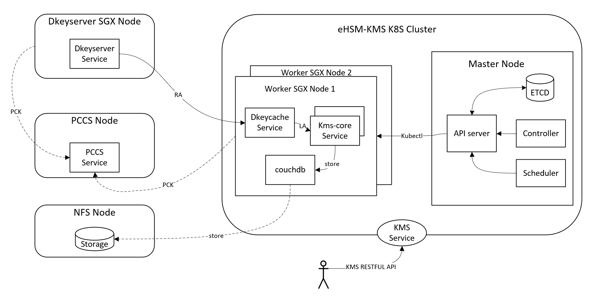

# eHSM-KMS Deployment with K8S
Welcome to see the k8s deployment instructions for the eHSM-KMS project.

---

## Architecture overview of the eHSM-KMS in the K8S cluster
This below diagram depicts the high-level overview of the eHSM-KMS in K8S cluster,<br>


---

## Prerequisites
* A running kubernetes cluster environment, if not, please follow [k8s-setup-guide](k8s-setup-guide.md) to setup the K8S cluster.
    * The worker nodes MUST support SGX(need FLC support for DCAP remote attestation).
    * The Master is a generic node.
* A centralized dkeyserver node for domain key provisioning.
    * MUST support SGX (w/ FLC) OR directly connect with a dedicated HSM.
* A NFS server, if not, please follow [nfs-setup-guide](nfs-setup-guide.md) to setup a nfs server.
* A running PCCS-service. (Suggest to host it in another dedicate node.)

---

## Deployment
* Download and Start the Dkeyserver service in the Dkeyserver node

    ```Shell
    wget https://github.com/intel/ehsm/tree/main/docker/k8s/run_dkeyserver.sh

    # modify the below configs
    EHSM_DOCKER_IMAGE_NAME="intelccc/ehsm_dkeyserver:0.2.0"  --> <your_dkeyserver_image>
    HOST_PORT=8888                                           --> <your_dkeyserver_port>
    DOCKER_PORT=8888
    PCCS_URL="https://10.112.240.166:8081"                   --> <your_PCCS_URL>

    # run the script
    ./run_dkeyserver.sh
    ```
    

* Download and modify the yaml file in the K8S master node.
    ```Shell
    Notes: You can get the example YAML file from:
    https://github.com/intel/ehsm/tree/main/docker/k8s/ehsm-kms.yaml

    # Modify the below parameters based on your environment

    data:
        dkeyserver_ip: "1.2.3.4"               --> <your_dkeyserver_ip>
        dkeyserver_port: "8888"                --> <your_dkeyserver_port>
        pccs_url: "https://1.2.3.4:8081"       --> <your_nfs_folder>


    nfs:
        path: /nfs_ehsm_db                     --> <your_nfs_folder>
        server: 1.2.3.4                        --> <your_nfs_ip>

     containers:
      - name: dkeycache
        image: intelccc/ehsm_dkeycache:latest     --> <your_dkeycache_image>

    initContainers:
       - name: init-ehsm-kms
        image: intelccc/ehsm_kms_service:latest   --> <your_kms_image>

    containers:
      - name: ehsm-kms
        image: intelccc/ehsm_kms_service:latest   --> <your_kms_image>

    kind: Service
    metadata:
    name: ehsm-kms-service
    namespace: ehsm-kms
    ....
    externalIPs:
    - 1.2.3.4                                --> <your_kms_external_ipaddr, you need try to find an unused IP>
    ```

 * Create namespace and apply the yaml file
    ```Shell
    # Create ehsm-kms namespace
    $ kubectl create namespace ehsm-kms

    # apply the yaml file with ehsm-kms namespace
    $ kubectl apply -f ehsm-kms.yaml -n ehsm-kms
    ```

    Then, you will get the below result:<br>
    <br>

Notes:
With this deployment config file, it will publish the ehsm-kms as a loadbalancer service in k8s cluster, the customer could visit it by the \<***external ip:port***\><br>

---

## Useful commands for debug purpose
* kubectl delete commands
    ```Shell
    kubectl delete svc couchdb -n ehsm-kms
    kubectl delete svc ehsm-kms-service -n ehsm-kms
    kubectl delete deployment ehsm-kms-deployment -n ehsm-kms
    kubectl delete ds dkeycache-deamonset -n ehsm-kms
    kubectl delete sts couchdb -n ehsm-kms
    kubectl delete pvc couch-persistent-storage-couchdb-0 -n ehsm-kms
    kubectl delete pv ehsm-pv-nfs -n ehsm-kms
    kubectl delete cm ehsm-configmap -n ehsm-kms
    kubectl delete secret ehsm-secret -n ehsm-kms
    ```
* kubectl get commands
    ```Shell
    kubectl get pv -n ehsm-kms
    kubectl get pvc -n ehsm-kms
    kubectl get sts -n ehsm-kms
    kubectl get pod -n ehsm-kms
    kubectl get pod -o wide -n ehsm-kms
    kubectl get deployment -n ehsm-kms
    kubectl get ds -n ehsm-kms
    kubectl get svc -n ehsm-kms
    kubectl get cm -n ehsm-kms
    kubectl get secret -n ehsm-kms
    kubectl get all -n ehsm-kms
    ```
* kubectl describe commands
    ```Shell
    kubectl describe cm ehsm-configmap -n ehsm-kms
    kubectl describe secret ehsm-secret -n ehsm-kms
    kubectl describe svc couchdb -n ehsm-kms
    kubectl describe pod ehsm-kms-deployment-xxxxxx-xxx -n ehsm-kms
    ```
* kubectl log commands
    ```Shell
    kubectl logs -f ehsm-kms-deployment-xxxxxx-xxx -n ehsm-kms
    kubectl logs -f ehsm-kms-deployment-xxxxxx-xxx -c ehsm-kms -n ehsm-kms
    kubectl logs -f ehsm-kms-deployment-xxxxxx-xxx -c init-ehsm-kms -n ehsm-kms
    ```
* kubectl exec commands
    ```Shell
    kubectl exec couchdb-0  -n ehsm-kms -it  -- /bin/sh
    kubectl exec -it ehsm-kms-deployment-xxxxxx-xxx -n ehsm-kms -- /bin/sh
    ```
* network commands
    ```Shell
    ipvsadm -Ln
    ```
* nfs commands
    ```Shell
    showmount -e 1.2.3.4
    ```