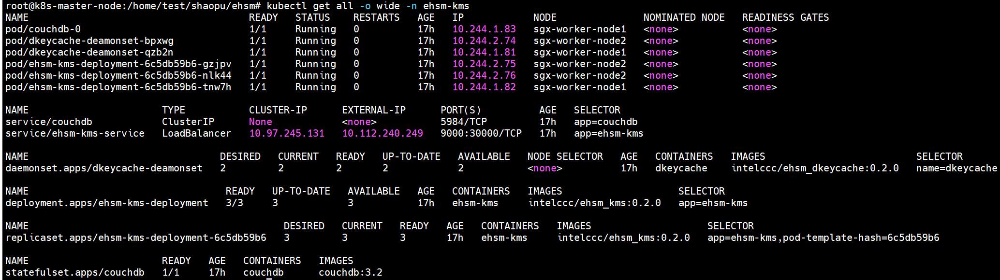

# eHSM-KMS Deployment with K8S
Welcome to see the k8s deployment instructions for the eHSM-KMS project.

---

## Architecture overview of the eHSM-KMS in the K8S cluster
This below diagram depicts the high-level overview of the eHSM-KMS in K8S cluster,<br>


---

## Prerequisites
* Ensure you already have a running kubenetes cluster environment, if not, please follow [k8s-setup-guide](k8s-setup-guide.md) to setup the K8S cluster.
* Ensure you already have a NFS server, if not, please follow [nfs-setup-guide](nfs-setup-guide.md) to setup a nfs server.

---

## Deployment
* Download and modify the yaml file
    ```Shell
    $ wget https://github.com/intel/ehsm/tree/main/ehsm_kms_service/k8s/ehsm-kms.yaml

    # Modify the below parameters based on your environment
    data:
        couch_root_username: YWRtaW4=          --> <your_db_user>
        couch_root_password: cGFzc3dvcmQ=      --> <your_db_passwd>

    nfs:
        path: /nfs_ehsm_db                     --> <your_nfs_folder>
        server: 1.2.3.4                        --> <your_nfs_ipaddr>

    containers:
      - name: ehsm-kms
        image: intel/ehsm_kms_service:latest   --> <tag your ehsm-kms container image as this name on the worker node or modify it to point your private docker hub>
        imagePullPolicy: IfNotPresent

    kind: Service
    metadata:
    name: ehsm-kms-service
    namespace: ehsm-kms
    ....
    externalIPs:
    - 1.2.3.4                                --> <your_kms_external_ipaddr>
    ```
 * Create namespace and apply the yaml file
    ```Shell
    # Create ehsm-kms namespace
    $ kubectl create namespace ehsm-kms

    # apply the yaml file with ehsm-kms namespace
    $ kubectl apply -f ehsm-kms.yaml -n ehsm-kms
    ```

Then, you will get the below result:<br>
<br>

Notes:
With this deployment config file, it will publish the ehsm-kms as a loadbalancer service in k8s cluster, the customer could visit it by the \<***external ip:port***\><br>

---

## Useful commands for debug purpose
* kubectl delete commands
    ```Shell
    kubectl delete svc couchdb -n ehsm-kms
    kubectl delete svc ehsm-kms-service -n ehsm-kms
    kubectl delete deployment ehsm-kms-deployment -n ehsm-kms
    kubectl delete sts couchdb -n ehsm-kms
    kubectl delete pvc couch-persistent-storage-couchdb-0 -n ehsm-kms
    kubectl delete pv ehsm-pv-nfs -n ehsm-kms
    kubectl delete cm ehsm-configmap -n ehsm-kms
    kubectl delete secret ehsm-secret -n ehsm-kms
    ```
* kubectl get commands
    ```Shell
    kubectl get pv -n ehsm-kms
    kubectl get pvc -n ehsm-kms
    kubectl get sts -n ehsm-kms
    kubectl get pod -n ehsm-kms
    kubectl get pod -o wide -n ehsm-kms
    kubectl get deployment -n ehsm-kms
    kubectl get svc -n ehsm-kms
    kubectl get cm -n ehsm-kms
    kubectl get secret -n ehsm-kms
    kubectl get all -n ehsm-kms
    ```
* kubectl describe commands
    ```Shell
    kubectl describe cm ehsm-configmap -n ehsm-kms
    kubectl describe secret ehsm-secret -n ehsm-kms
    kubectl describe svc couchdb -n ehsm-kms
    kubectl describe pod ehsm-kms-deployment-xxxxxx-xxx -n ehsm-kms
    ```
* kubectl log commands
    ```Shell
    kubectl logs -f ehsm-kms-deployment-xxxxxx-xxx -n ehsm-kms
    kubectl logs -f ehsm-kms-deployment-xxxxxx-xxx -c ehsm-kms -n ehsm-kms
    ```
* kubectl exec commands
    ```Shell
    kubectl exec couchdb-0  -n ehsm-kms -it  -- /bin/sh
    kubectl exec -it ehsm-kms-deployment-xxxxxx-xxx -n ehsm-kms -- /bin/sh
    ```
* network commands
    ```Shell
    ipvsadm -Ln
    ```
* nfs commands
    ```Shell
    showmount -e 1.2.3.4
    ```